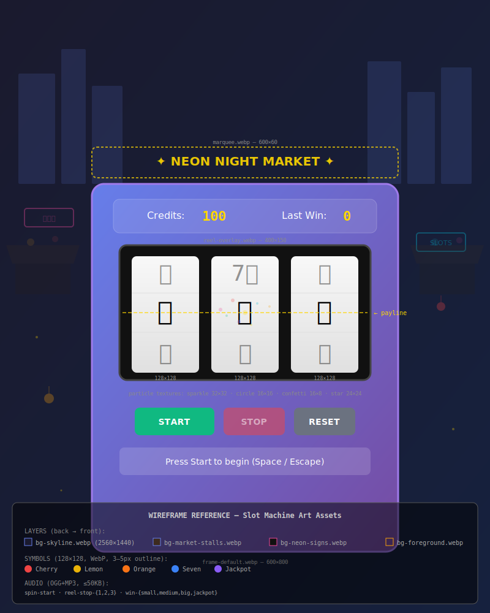

# Art Asset Requirements

Required art and audio assets for Dopamine games, with technical specs, delivery instructions, and validation criteria.

---

## Wireframe Reference

Use the annotated wireframe below as a visual guide when creating assets. It shows where each asset appears in the final game, with dimension annotations and color keys.

**[`slot-machine-wireframe.svg`](wireframes/slot-machine-wireframe.svg)** — open in any browser or SVG editor (Inkscape) to inspect.



The wireframe shows:
- **Background layers** — parallax skyline, market stalls, neon signs, foreground particles
- **Machine cabinet** — frame area (600×800), marquee strip, reel window
- **3 reels** — symbol cells (128×128 each), payline indicator
- **UI chrome** — credit/win display, controls (Start/Stop/Reset), status bar
- **Annotation legend** — layer names, symbol color keys, audio file list

---

## Required Tools (Free Software Only)

All asset creation should use **free and open-source software**. Do not assume contributors have access to paid tools.

| Purpose | Recommended Tool | Notes |
|---------|-----------------|-------|
| 2D sprites & icons | [GIMP](https://www.gimp.org/) | Symbol sprites, particle textures, UI elements |
| Vector graphics | [Inkscape](https://inkscape.org/) | SVG source files, clean scalable artwork |
| 3D renders / scenes | [Blender](https://www.blender.org/) | Environment backgrounds, machine frame renders — [**see Blender workflow guide**](BLENDER_ASSET_CREATION.md) |
| Audio editing | [Audacity](https://www.audacityteam.org/) | Sound effect creation, normalization, format export |
| Music / DAW | [LMMS](https://lmms.io/) | Music production, synthesis (if background music is added later) |
| Pixel art | [LibreSprite](https://libresprite.github.io/) | Alternative for retro-style sprite work |
| Compositing | [Krita](https://krita.org/) | Digital painting, layer compositing |

> **Note:** Proprietary tools (Photoshop, Figma, FL Studio, etc.) may be used if the contributor already has access, but documentation and workflows should assume free alternatives. SOURCES.md should list the actual tool used.

---

## Slot Machine: "Neon Night Market"

### 1. Symbol Sprites

Five symbols are needed, each in multiple states.

| Symbol | Idle Image | Spin Blur | Win Glow | Specs |
|--------|-----------|-----------|----------|-------|
| 🍒 Cherry | `cherry-idle.webp` | `cherry-blur.webp` | `cherry-glow.webp` | See below |
| 🍋 Lemon | `lemon-idle.webp` | `lemon-blur.webp` | `lemon-glow.webp` | See below |
| 🍊 Orange | `orange-idle.webp` | `orange-blur.webp` | `orange-glow.webp` | See below |
| 7️⃣ Seven | `seven-idle.webp` | `seven-blur.webp` | `seven-glow.webp` | See below |
| 💎 Jackpot | `jackpot-idle.webp` | `jackpot-blur.webp` | `jackpot-glow.webp` | See below |

**Per-symbol specs:**

| Property | Requirement | Reference |
|----------|-------------|-----------|
| Dimensions | 128×128 px (2x for retina; renders at 64×64) | VR-3.2 |
| Format | WebP primary, PNG fallback | VR-3.3 |
| File size | ≤ 15 KB per image | PR-1.1 |
| Outline | 3–5 px dark stroke for legibility | VR-3.1 |
| Style | Vector-style with highlight/shadow for depth | VR-3.4 |
| Fine detail | Avoid — blurs during spin animation | VR-3.5 |
| Color key | Cherry `#ef4444`, Lemon `#eab308`, Orange `#f97316`, Seven `#3b82f6`, Jackpot `#8b5cf6` | VR-1.3, config.js |
| Transparency | Yes — transparent background (PNG-24 / WebP lossless) | — |

**Deliverables:** 15 images total (5 symbols × 3 states). Optional: SVG source files.

---

### 2. Background Environment Layers

Parallax layers for the "Neon Night Market" scene. Each layer scrolls independently (VR-6.1–6.6).

| Layer | File | Dimensions | Content | Speed |
|-------|------|-----------|---------|-------|
| Far background | `bg-skyline.webp` | 2560×1440 | City skyline silhouette, animated window lights | Slowest |
| Mid background | `bg-market-stalls.webp` | 2560×1440 | Market stalls with hanging lanterns | Medium |
| Near background | `bg-neon-signs.webp` | 2560×1440 | Neon signs, kanji/symbols, color-cycling glow | Faster |
| Foreground | `bg-foreground.webp` | 2560×1440 | Floating lanterns, fireflies, ambient particles | Fastest |

**Per-layer specs:**

| Property | Requirement | Reference |
|----------|-------------|-----------|
| Dimensions | 2560×1440 px (oversized for parallax panning) | Brief 02 |
| Format | WebP (lossy, quality 80+) primary, PNG fallback (transparency required) | — |
| File size | ≤ 200 KB per layer | PR-1.1 |
| Color palette | Deep blue-purple `#1a1a2e` base, warm neon accents | VR-1.4, Brief 02 |
| Separability | Each layer must have transparent regions where deeper layers show through | VR-6.1 |
| Tile-ability | Far and mid layers should tile horizontally for infinite scroll | — |

**Deliverables:** 4 images. Optional: layered source (GIMP `.xcf`, Krita `.kra`, or Blender `.blend`).

---

### 3. Machine Frame & UI Chrome

The slot machine cabinet and surrounding UI elements.

| Asset | File | Dimensions | Description |
|-------|------|-----------|-------------|
| Machine frame | `frame-default.webp` | 600×800 | Main cabinet frame with neon edge lighting |
| Frame win state | `frame-win.webp` | 600×800 | Gold-tinted glow variant for win celebrations |
| Frame jackpot state | `frame-jackpot.webp` | 600×800 | Magenta/gold pulsing variant for jackpot |
| Reel window overlay | `reel-overlay.webp` | 400×150 | Glass reflection, subtle curved highlight |
| Marquee border | `marquee.webp` | 600×60 | Neon marquee strip for top of machine |

**Specs:**

| Property | Requirement |
|----------|-------------|
| Format | WebP primary, PNG fallback |
| File size | ≤ 80 KB per frame image, ≤ 30 KB per overlay |
| Style | Art deco/retro-modern, brushed metal, warm glass, chrome accents |
| Transparency | Frame images need transparent reel window area for compositing |
| Glow effects | Baked glow is acceptable; game adds dynamic CSS glow on top |

**Deliverables:** 5 images. Optional: SVG (Inkscape) or `.xcf` (GIMP) source.

---

### 4. Particle Textures

Small textures used by the canvas-based particle system (VR-8.1–8.5).

| Asset | File | Dimensions | Description |
|-------|------|-----------|-------------|
| Sparkle | `particle-sparkle.png` | 32×32 | Soft 4-point star, white, used for tinting |
| Circle | `particle-circle.png` | 16×16 | Soft-edge circle, white, general-purpose |
| Confetti | `particle-confetti.png` | 16×8 | Rectangular confetti piece, white |
| Star | `particle-star.png` | 24×24 | 5-point star, white |

**Specs:**

| Property | Requirement |
|----------|-------------|
| Format | PNG-24 with alpha transparency |
| File size | ≤ 2 KB each |
| Color | White — game applies color tinting at runtime |
| Edge | Soft/feathered edges for smooth blending |

**Deliverables:** 4 images.

---

### 5. Audio Assets

Sound effects for game interactions (AR-1.1–1.5).

| Sound | Files | Duration | Description |
|-------|-------|----------|-------------|
| Spin start | `spin-start.ogg`, `spin-start.mp3` | ~250 ms | Mechanical whir, fade-in |
| Reel stop 1 | `reel-stop-1.ogg`, `reel-stop-1.mp3` | ~50 ms | Click/thunk, neutral pitch |
| Reel stop 2 | `reel-stop-2.ogg`, `reel-stop-2.mp3` | ~50 ms | Click/thunk, slightly higher pitch |
| Reel stop 3 | `reel-stop-3.ogg`, `reel-stop-3.mp3` | ~50 ms | Click/thunk, highest pitch |
| Win small | `win-small.ogg`, `win-small.mp3` | ~500 ms | Gentle chime, warm tone |
| Win medium | `win-medium.ogg`, `win-medium.mp3` | ~800 ms | Ascending chime sequence |
| Win big | `win-big.ogg`, `win-big.mp3` | ~1200 ms | Celebratory fanfare, contained |
| Win jackpot | `win-jackpot.ogg`, `win-jackpot.mp3` | ~2000 ms | Full celebration, gold-warm tone |

**Specs:**

| Property | Requirement | Reference |
|----------|-------------|-----------|
| Formats | OGG primary, MP3 fallback (both required) | AR-1.4 |
| File size | ≤ 50 KB per file | AR-1.4 |
| Sample rate | 44.1 kHz or 48 kHz | — |
| Channels | Mono (saves file size, game handles panning) | — |
| Normalization | -3 dB peak, consistent loudness across all clips | — |
| Style | Arcade-warm, not casino-harsh. Cozy and satisfying. | Design Principles |
| Licensing | Royalty-free, attribution-compatible, or original | assets/README.md |

**Deliverables:** 16 audio files (8 sounds × 2 formats).

---

## Gacha: "Endless Hoard" (Future — for reference)

Assets will be specified in detail when the gacha game enters active development. Expected needs:

| Category | Count | Notes |
|----------|-------|-------|
| Treasure chest sprites | 4 | One per rarity tier (Common, Rare, Epic, Legendary) |
| Chest open animation frames | ~28 | 7 frames × 4 tiers |
| Loot item icons | ~20 | Collectible item sprites |
| Background | 1–2 | Treasure vault / dungeon environment |
| Audio | ~10 | Chest rattle, open, reveal per tier, collect |

---

## Delivery Process

### How to Submit Art Assets

1. **Fork the repository** and create a branch named `art/<game>-<category>` (e.g., `art/slot-symbols`, `art/slot-audio`).

2. **Place files in the correct directory:**

   ```
   assets/
   ├── images/
   │   └── slot-machine/
   │       ├── symbols/         ← symbol sprites
   │       ├── environment/     ← background layers
   │       ├── frame/           ← machine frame & UI chrome
   │       └── particles/       ← particle textures
   └── sounds/
       └── slot-machine/        ← audio files
   ```

3. **Follow the naming convention:**
   ```
   <descriptive-name>.<ext>
   
   Examples:
   cherry-idle.webp
   bg-skyline.webp
   spin-start.ogg
   particle-sparkle.png
   ```

4. **Include a `SOURCES.md`** in each subdirectory with:
   - Tool(s) used to create the asset (GIMP, Blender, Audacity, Inkscape, etc.)
   - License information (original work, CC0, CC-BY, etc.)
   - Attribution if required by the license
   - Brief description of the creative process

5. **Open a Pull Request** with:
   - Title: `Art: <game> <category>` (e.g., `Art: slot-machine symbols`)
   - Description listing all files added, with thumbnail previews for images
   - Reference to the relevant spec section in this document
   - Confirmation that all validation criteria (see below) have been checked

### Batch vs. Incremental Delivery

- **Preferred:** Submit complete categories (e.g., all 15 symbol sprites at once) for consistent review.
- **Acceptable:** Submit partial batches if noted in the PR description (e.g., "3 of 5 symbols — remaining 2 in follow-up").
- **Not accepted:** Individual files without context or category grouping.

---

## Validation Checklist

Every submitted art asset must pass these checks before merging. Reviewers use this checklist; contributors should self-check before submitting.

### Image Validation

- [ ] **Dimensions match spec** — Exactly as specified in the requirements table above
- [ ] **Format is correct** — WebP/PNG as specified, not JPEG for sprites or BMP
- [ ] **File size within budget** — Under the per-asset KB limit listed above
- [ ] **Transparency correct** — Sprites have transparent backgrounds; backgrounds have proper alpha where needed
- [ ] **Color palette consistent** — Uses the project color keys (compare against hex values in spec)
- [ ] **Legibility test** — Symbols readable at 64×64 display size (50% zoom of 128×128 source)
- [ ] **Retina quality** — No visible pixelation at 2x display (zoom to 100% on retina screen)
- [ ] **No fine-detail artifacts** — Nothing that will smear/alias during spin animation
- [ ] **Visual consistency** — Style matches other assets in the same category (outline weight, shadow direction, color saturation)

### Audio Validation

- [ ] **Both formats present** — OGG and MP3 for each sound
- [ ] **Duration matches spec** — Within ±20% of the target duration
- [ ] **File size within budget** — Under 50 KB per file
- [ ] **No clipping** — Peak level at or below -3 dB
- [ ] **Clean start/end** — No clicks, pops, or silence padding beyond 10 ms
- [ ] **Consistent loudness** — Perceived volume matches other sounds in the set
- [ ] **Mono channel** — Single channel, not stereo (unless stereo is explicitly required)
- [ ] **Style-appropriate** — Warm/arcade tone, not harsh/casino-realistic

### Licensing Validation

- [ ] **SOURCES.md present** — In the same directory as the assets
- [ ] **License declared** — Each asset has a clear license statement
- [ ] **Attribution included** — If the license requires it
- [ ] **No copyrighted material** — No unlicensed third-party content
- [ ] **Compatible license** — License allows open-source distribution (MIT-compatible)

### Integration Test (Post-Merge)

- [ ] **Assets load in browser** — Open `index.html` and verify no 404s in console
- [ ] **Performance maintained** — Page load under 3 seconds on simulated 3G
- [ ] **60 fps maintained** — No frame drops with new assets active
- [ ] **Reduced motion respected** — Assets that animate have `prefers-reduced-motion` fallback
- [ ] **Accessibility** — Decorative images have empty `alt=""`; meaningful images have descriptive `alt`

---

## Automated Validation Script

A validation script is available to check file specs before submitting a PR:

```bash
# Run from repository root
# Checks dimensions, file size, and format of all assets in a directory

./scripts/validate-assets.sh assets/images/slot-machine/symbols/

# Expected output:
# ✅ cherry-idle.webp — 128×128, 12 KB, WebP
# ✅ cherry-blur.webp — 128×128, 8 KB, WebP
# ❌ cherry-glow.webp — 256×256 (expected 128×128)
# ❌ lemon-idle.png — Wrong format (expected .webp)
```

> **Note:** The validation script (`scripts/validate-assets.sh`) will be created as assets begin arriving. Contributors can manually verify specs using GIMP (Image → Canvas Size), `identify` (ImageMagick), or `ffprobe` (FFmpeg) — all free and cross-platform.

---

## Asset Summary

| Category | Files | Total Budget | Status |
|----------|-------|-------------|--------|
| Symbol sprites | 15 | 225 KB | ⏳ Not started |
| Background layers | 4 | 800 KB | ⏳ Not started |
| Machine frame/UI | 5 | 360 KB | ⏳ Not started |
| Particle textures | 4 | 8 KB | ⏳ Not started |
| Audio | 16 | 800 KB | ⏳ Not started |
| **Total** | **44** | **~2.2 MB** | — |

---

## Related Documents

| Document | What It Covers |
|----------|---------------|
| [Wireframe SVG](wireframes/slot-machine-wireframe.svg) | Annotated layout showing where each asset appears |
| [Asset Workflow](ASSET_WORKFLOW.md) | 7-phase design pipeline (narrative → integration) |
| [**Blender Asset Creation**](BLENDER_ASSET_CREATION.md) | **Step-by-step Blender workflows for all 3D-rendered assets** |
| [Art Briefs](concept-art/slot-machine/README.md) | Creative direction per category |
| [AI Prompts](concept-art/slot-machine/AI_IMAGE_GENERATION_PROMPTS.md) | Prompt library for concept generation |
| [Artist Quickstart](concept-art/ARTIST_QUICKSTART.md) | 5-minute onboarding for new contributors |
| [Technical Plan](../TECHNICAL_PLAN_SLOT_MACHINE.md) | Code architecture the assets plug into |
| [Design Spec](visual/SLOT_MACHINE_ITERATION_01.md) | Full VR/AR requirement definitions |
